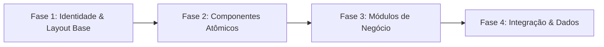

# Mapeamento do Sistema GLA Inema & Arquitetura de Clonagem

> **Ambiente Inspecionado:** `https://gla-inema-hml.acto.com.br/`  
> **Perfil de Acesso:** Lucas Guariero (Analista / Gestor DIFIS)  
> **Tecnologia Base Upstream:** Laravel 11 + Filament Admin v3/v4 (Livewire 3, Alpine.js, Tailwind CSS)  
> **Status:** Mapeamento Concluído & Saneamento Visual Aplicado  

---

## 1. Identidade Visual & Design Tokens (Upstream)

### 1.1. Logotipo Institucional
- **Asset Oficial:** `/images/logo.svg` (SVG com elemento `use` referenciando imagem em alta resolução com lettering institucional `inema` e detalhe em acento laranja).
- **Banner de Autenticação:** `/images/inema-banner.jpeg` (Fotografia da Cachoeira da Fumaça - Chapada Diamantina).
- **Renderização Padrão no Topo/Sidebar:**
  ```html
  
  ```

### 1.2. Paleta de Cores & Tokens CSS (OKLCH e HEX Equivalentes)
| Token / Contexto | Valor Upstream (Computed) | Hex / Tailwind Equivalente | Aplicação |
|---|---|---|---|
| **Verde Primário Institucional** | `color(srgb 0 0.329412 0.317647)` / `#002f25` | `#0F4C3A` / `#002f25` | Headers institucionais, botões primários, ícones ativos |
| **Verde Sálvia Ativo** | `color(srgb 0 0.329412 0.317647 / 0.2)` | `#E2ECE9` | Fundo de itens ativos na navegação da sidebar |
| **Texto de Item Ativo** | `rgb(0, 37, 36)` | `#002524` | Tipografia de navegação quando selecionada |
| **Fundo da Página (Body Surface)** | `rgb(249, 250, 251)` | `#F9FAFB` (`bg-slate-50` / `bg-gray-50`) | Plano de fundo de todas as páginas |
| **Fundo de Cards e Sidebar** | `rgb(255, 255, 255)` | `#FFFFFF` (`bg-white`) | Cards de conteúdo, containers de formulário e menu lateral |
| **Bordas Estruturais** | `rgb(229, 231, 235)` | `#E5E7EB` (`border-slate-200` / `border-gray-200`) | Linha divisória da sidebar, bordas de cards e inputs |
| **Tipografia Principal (Headings)** | `oklch(0.141 0.005 285.823)` | `#191C1E` (`text-slate-900`) | Títulos h1, h2 e destaques |
| **Texto Secundário / Labels** | `rgb(107, 114, 128)` | `#6B7280` (`text-slate-500`) | Rótulos de campos, microcopys e breadcrumbs |
| **Subtítulos de Navegação** | `rgb(148, 163, 184)` | `#94A3B8` (`text-slate-400`) | Cabeçalhos de subgrupos da sidebar (caixa alta) |
| **Alerta / Emergência (Rose/Red)** | `rgb(225, 29, 72)` | `#E11D48` (`bg-rose-500`, `text-rose-700`) | Badges de emergência química, alertas críticos |
| **Atenção / Advertência** | `rgb(217, 119, 6)` | `#D97706` (`bg-amber-500`, `text-amber-800`) | Avisos de tramitação, status em análise |

### 1.3. Tipografia Institucional
- **Família Tipográfica Primária:** `Inter Variable`, `Inter`, `system-ui`, `-apple-system`, `BlinkMacSystemFont`, `sans-serif`.
- **Hierarquia de Texto:**
  - `h1` (Títulos de Página): `font-bold` (700), tamanho `24px` a `30px` (`text-2xl` a `text-3xl`), tracking suave (`tracking-tight`).
  - `h2` / `h3` (Seções de Cards): `font-semibold` (600), tamanho `16px` a `18px` (`text-base` a `text-lg`).
  - Labels de Formulário: `font-medium` ou `font-semibold`, tamanho `12px` a `14px` (`text-xs` ou `text-sm`), cor `text-slate-700`.
  - Corpo da Tabela e Inputs: `text-xs` (`12px`) ou `text-sm` (`14px`), `font-normal` (400) com dados em `font-medium` (500).
  - **Diretriz de Saneamento:** Eliminação de qualquer classe `font-mono` em dados de negócio, IDs e tabelas.

---

## 2. Catálogo de Componentes do GLA Inema

### 2.1. Topbar / Header Institucional
- Altura padrão de `60px` a `64px` com fundo verde institucional (`#0F4C3A`), fixo no topo (`fixed top-0 left-0 right-0 z-50`).
- **Esquerda estrita:** Botão hambúrguer `☰` para controle da sidebar responsiva + Logo oficial `logo.svg` com link para a home. Zero ruídos, sem caixas com letra "S", sem menções a SEIA ou badges duplicadas.
- **Direita:**
  - Campo de busca global rápido com ícone de lupa translúcido.
  - Indicador de notificações com badge circular vermelha.
  - Avatar do usuário autenticado (iniciais em círculo translúcido + nome e perfil).

### 2.2. Sidebar (Menu Lateral de Navegação)
- Largura: `280px` (desktop) a `320px` (upstream Filament). Fundo branco (`#FFFFFF`) e borda direita `#E5E7EB`.
- Estrutura agrupada por contexto de negócio (Accordion/Expansível):
  - **Início** (ícone Home).
  - **Fiscalização** (ícone de Prancheta/Inspeção, expansível):
    - Subgrupo **Denúncias** (`Atendente`, `Formulário Cidadão`).
    - Subgrupo **Emergências Químicas** (`Cadastro Interno`, `Registro Externo`).
    - Subgrupo **Consultas** (`Consulta Cidadão`, `Painel Interno DIFIS` com badge numérica de emergências ativas).
  - **Relatórios Gerenciais** (ícone de Gráfico).
  - **Rodapé Fixo:** Acesso rápido ao Assistente INEMA (botão institucional com ícone Sparkles).
- Subtítulos de grupo: `text-slate-400 font-semibold text-[11px] tracking-wider uppercase px-3 pt-2 pb-1` sem linhas horizontais divisórias, com respiro vertical (`space-y-4`).

### 2.3. Formulários & Entradas de Dados
- **Cards Agrupadores:** Fundo branco, cantos arredondados (`rounded-xl`), borda sutil (`border border-slate-200/80`), sombra mínima (`shadow-xs`), cabeçalho da seção com numeração sequencial estilizada ou ícone temático.
- **Inputs de Texto e Selects:**
  - Altura compacta (`py-2 px-3`), texto `text-xs` ou `text-sm`.
  - Bordas cinza neutro (`border border-slate-300`), foco com anel verde institucional (`focus:border-[#0F4C3A] focus:ring-1 focus:ring-[#0F4C3A] outline-none`).
  - Inputs bloqueados/somente leitura: fundo cinza claro (`bg-slate-100 text-slate-600 cursor-not-allowed border-slate-200`).
- **Upload de Arquivos (FilePond / Padrão Gov.br):** Área de arrastar e soltar com validação estrita de extensões permitidas e limite máximo de 50MB por anexo.

### 2.4. Tabelas de Dados & Listagens Operacionais
- Cabeçalho: Fundo cinza suave (`bg-slate-50`), texto `text-[11px]` em caixa alta, `font-semibold text-slate-600`, borda inferior clara.
- Linhas de Dados: Alternância suave ou linhas brancas com `hover:bg-slate-50/80 transition-colors`, espaçamento vertical compacto (`py-3 px-4`).
- Badges de Situação: Pílulas com borda e contraste suave (ex.: `bg-rose-50 text-rose-700 border-rose-200` para Emergência Registrada; `bg-amber-50 text-amber-700 border-amber-200` para Análise Técnica; `bg-emerald-50 text-emerald-700 border-emerald-200` para Concluída).
- Ações na Tabela: Botões compactos de ação (`Visualizar`, `Editar`, `Anexar Relatório`, `Assumir Análise`).

### 2.5. Drawer Lateral de Visualização Protegida
- Painel deslizante à direita (`w-full max-w-2xl bg-white shadow-2xl z-50`), com backdrop escurecido.
- Abas de navegação internas: `Dados do Registro`, `Comunicante`, `Áreas Atingidas / Coordenadas`, `Anexos & Relatórios`, `Histórico de Auditoria`.

---

## 3. Mapeamento Completo de Telas e Módulos do GLA Inema Real

A inspeção automatizada realizada no ambiente de homologação identificou os seguintes módulos de negócio e respectivas rotas:

```text
GLA INEMA (https://gla-inema-hml.acto.com.br/)
├── 🏠 Início (Dashboard / Acesso Rápido) [/]
│   ├── Iniciar Requerimento [/requerimento/informacoes]
│   ├── Meus Processos [/meus-processos]
│   ├── Acesso Público [/acesso-publico]
│   └── Notificações [/notificacoes]
│
├── 👤 Meu Cadastro (Identificação e Vinculação)
│   ├── Dados Pessoais [/meu-cadastro]
│   ├── Procurador [/procuradores]
│   ├── Empreendimentos [/empreendimentos]
│   ├── Representante Legal [/representantes-legais]
│   ├── Representações / Consultorias [/consultorias]
│   └── Responsável Técnico [/responsaveis-tecnicos]
│
├── 📑 Requerimentos & Transportes
│   └── Declaração de Transportes de Produtos Perigosos [/dtrp-requerimento/dtrp-requerimentos]
│
├── 🔍 Fiscalização (DIFIS)
│   ├── Denúncias Ambientais (RD)
│   │   ├── Atendimento Interno (Call Center / Triagem) [/fiscalizacao]
│   │   └── Formulário Externo do Cidadão [/fiscalizacao?fluxo=externo]
│   ├── Emergências Químicas (RE)
│   │   ├── Cadastro e Tramitação Interna [/emergencia-quimica]
│   │   ├── Escalas de Plantão e Plantonistas Ativos [/fiscalizacao/escalas-plantao]
│   │   └── Registro Externo pelo Comunicante [/emergencia-quimica-externa]
│   └── Consultas e Painéis Operacionais
│       ├── Consulta de Registros Externos (Portal Cidadão) [/consulta-externa]
│       └── Painel Interno DIFIS (Gestão Operacional) [/consulta-interna]
│
├── ⚙️ Análise Técnica & Processos
│   ├── Pauta Técnico (Fila de Análise Individual)
│   ├── Pauta Coordenador (Distribuição e Homologação)
│   └── Processos Finalizados
│
├── 🏢 Administração
│   ├── Financeiro (Configuração de Juros de Mora)
│   ├── Segurança (Gestão de Acessos e Pessoas Físicas - 41 perfis cadastrados) [/pessoa-fisicas]
│   └── ANSLA (Configurações de Tramitação e Silos/Armazéns)
│
└── 🦜 SISPASS & Recursos Florestais
    ├── Meus Perfis SISPASS [/meus-perfis]
    ├── Validação de Calendário Anual [/validacao-calendario-anual]
    └── Reposição Florestal
```

---

## 4. Plano Estruturado de Clonagem e Migração (4 Fases)

Para realizar a clonagem integral do sistema GLA Inema com fidelidade visual absoluta e comportamento idêntico ao ambiente de homologação, o roteiro técnico está dividido em 4 fases sequenciais:



### 🔹 Fase 1: Identidade Visual e Layout Base (Concluída nesta etapa)
- [x] Extração e incorporação do `logo.svg` oficial com proporções exatas.
- [x] Padronização do Header institucional (hambúrguer + logo à esquerda; busca + notificações + avatar à direita).
- [x] Eliminação de divisores horizontais espúrios e faixas decorativas não institucionais.
- [x] Sidebar agrupada por arquitetura de informação com espaçamento vertical e tipografia `Inter`.
- [x] Erradicação de `font-mono` em números de registros, CPF/CNPJ e tabelas operacionais.

### 🔹 Fase 2: Componentes Atômicos & Formulários Avançados
- [ ] Biblioteca de inputs com máscaras dinâmicas (CPF, CNPJ, CEP, Coordenadas UTM/GMS).
- [ ] Integração de autocomplete de endereço via CEP com preenchimento em tempo real.
- [ ] Seletor múltiplo estilizado de Tipos de Ocorrência e Áreas Atingidas com chips removíveis.
- [ ] Componente FilePond institucional com drag-and-drop, indicador de progresso e validação mime-type.
- [ ] Tabela com ordenação por coluna, paginação dinâmica configurável (10, 25, 50 itens) e drawer lateral retrátil.

### 🔹 Fase 3: Telas & Módulos de Negócio
- [ ] Módulo Fiscalização: Conectar tramitação de atendimento interno com histórico em tempo real.
- [ ] Módulo Escalas de Plantão: Interface de alocação de técnicos por período com prevenção de sobreposição de datas.
- [ ] Módulo DTRP: Formulário de declaração de transporte de produtos e resíduos perigosos.
- [ ] Módulo ANSLA & Silos: Formulário em etapas (Step 1 a Step 3) com perguntas de enquadramento ambiental.
- [ ] Módulo SISPASS: Validação de anilhas, histórico e cadastro de passeriformes.

### 🔹 Fase 4: Integração, Autenticação & Consistência de Dados
- [ ] Módulo de autenticação simulando Gov.br Ouro/Prata e login interno CPF/Senha.
- [ ] Camada de Mock Storage desacoplada com IndexedDB / LocalStorage para persistência entre fluxos.
- [ ] Trilha de auditoria institucional em todas as ações (quem, quando, qual alteração).
- [ ] Suíte de testes E2E Playwright cobrindo 100% dos fluxos ponta a ponta sem erros de console.
