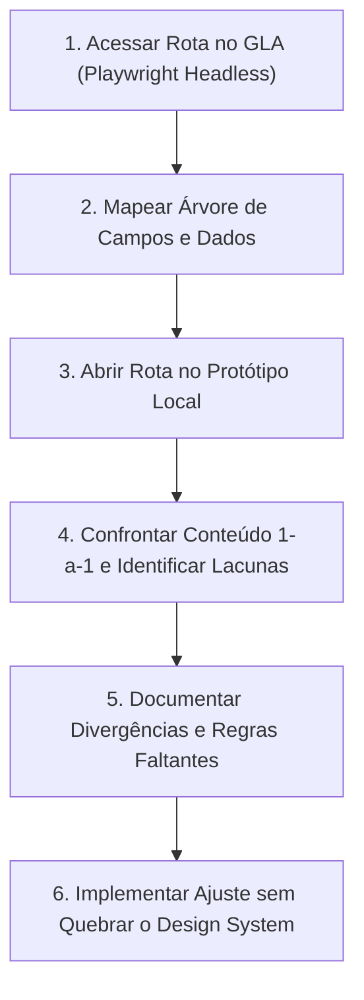

# 📋 Protocolo de Auditoria e Instrução Detalhada: Alinhamento das Páginas GLA Inema vs Protótipo SEIA V2

> **Ambiente Canônico de Referência (Upstream):** `https://gla-inema-hml.acto.com.br/`  
> **Ambiente Local / Protótipo:** `http://localhost:5173/?rota=seia-v2` / `https://inema.acto.com.br/?rota=seia-v2`  
> **Objetivo:** Estabelecer a instrução formal, passo a passo, de inspeção, mapeamento de divergências de conteúdo e alinhamento cirúrgico de cada tela do sistema com a sua respectiva página no GLA.

---

## 1. Diretrizes Fundamentais de Inspeção e Alinhamento

1. **Fidelidade Integral de Conteúdo**:
   - Cada tela do nosso protótipo deve conter **os mesmos campos, grupos de dados, fluxos de wizard, filtros, colunas de tabela, modais e ações** existentes na respectiva tela do GLA de Homologação.
2. **Design System Filament / SEIA V2 Inviolável**:
   - Todo o conteúdo importado do GLA deve ser estilizado rigorosamente através dos componentes canônicos do nosso Design System:
     - Verde institucional `#0F4C3A` como cor primária.
     - Primitivas reutilizáveis: `FilamentWizard`, `TableContainer`, `InputWrapper`, `FilamentSelect`, `Section`/`FilamentSection`, `Badge`, `Button`, `Dialog`.
     - Zero AI Slop (sem roxos, sem teals genéricos, sem ícones decorativos antes de títulos textuais).
3. **Imutabilidade e Segurança**:
   - A inspeção no GLA é estritamente **read-only** (nunca apagar dados, parâmetros ou cadastros existentes no ambiente de homologação).

---

## 2. Metodologia de Inspeção Espelhada (Passo a Passo)

Para cada página do sistema, o procedimento de inspeção e auditoria segue o seguinte ciclo:

1. **Extração no GLA**:
   - Inspecionar formulários, seções recolhíveis, validações obrigatórias (`required`), mensagens de ajuda e tooltips.
   - Mapear opções de select/combobox (dados parametrizados do INEMA).
   - Mapear cabeçalhos de tabelas, status, badges, filtros rápidos e botões de ação de linha.
2. **Confronto no Protótipo**:
   - Verificar se todos os campos necessários estão presentes.
   - Verificar se as etapas do Wizard correspondem ao fluxo real do ato administrativo.
   - Corrigir nomenclaturas técnicas e números de formulário oficial (ex: `F-DUC-xxx`, `F-DIFIS-xxx`, `DORxxx`).

---

## 3. Diagnóstico e Matriz de Conteúdo: GLA vs Protótipo

Abaixo está o mapeamento detalhado página por página, confrontando o conteúdo oficial do GLA com o estado atual do nosso protótipo e apontando as divergências a serem corrigidas:

---

### 📄 01. Iniciar Requerimento (`/requerimento/informacoes` / `F-DUC-069`)
* **Rota no Protótipo:** `/?rota=seia-v2&tela=formulario` (`src/components/seia-v2/SeiaV2FormularioComplexoPage.tsx`)
* **Conteúdo Canônico no GLA:**
  - **Etapa 1 — Identificação do Requerente & Procurador:**
    - Tipo de Requerente: Pessoa Física ou Jurídica.
    - Busca e validação de CPF/CNPJ com preenchimento automático de Razão Social / Nome, Nome Fantasia, Inscrição Estadual, Telefone e E-mail.
    - Indicação de Procurador Eletrônico outorgado (com verificação de instrumento de mandato).
  - **Etapa 2 — Empreendimento & Imóvel Rural (CEFIR/CAR):**
    - Seleção do Empreendimento cadastrado no SEIA.
    - Município, Bacia Hidrográfica, Bioma (Caatinga, Cerrado, Mata Atlântica).
    - Código CEFIR/CAR vinculado com status de validação ambiental (Ativo / Em Análise).
    - Poligonal e Coordenadas Geográficas (Graus Decimais ou GMS).
  - **Etapa 3 — Enquadramento de Tipologias e Atos Requeridos (Resolução CEPRAM):**
    - Tipologia Principal e Secundárias segundo a Resolução CEPRAM nº 4.579/2018.
    - Porte do Empreendimento (Micro, Pequeno, Médio, Grande, Excepcional).
    - Potencial Poluidor / Degradador (Pequeno, Médio, Alto) e Classe de Enquadramento (Classe 1 a 6).
    - Seleção dos Atos Ambientais Solicitados:
      - Licenças: LP, LI, LO, LU, LAC (Adesão e Compromisso), RL (Renovação), AL (Alteração).
      - Recursos Hídricos: Outorga de Captação Subterrânea / Superficial, Barramento, Lançamento de Efluentes, Dispensa de Outorga (CERH).
      - Recursos Florestais: Autorização de Supressão de Vegetação Nativa (ASV), Plano de Manejo Florestal Sustentável (PMFS), Crédito de Reposição Florestal (CRF).
  - **Etapa 4 — Caracterização Específica (FCE - Formulário de Caracterização do Empreendimento):**
    - Questionário técnico contextualizado à tipologia selecionada: volume de água captada (m³/dia), vazão de efluentes tratados, geração e destinação de resíduos sólidos perigosos (DTRP).
  - **Etapa 5 — Responsável Técnico & Estudos Ambientais:**
    - Cadastro do Responsável Técnico com ART/RRT/AFT homologada e número de conselho (CREA, CRBio, CRQ).
    - Upload de Estudos Obrigatórios via FilePond (EIA/RIMA, RCA, PCA, PRAD, Planta Topográfica).
  - **Etapa 6 — Declaração de Veracidade e Emissão do DAE:**
    - Resumo consolidado de todas as informações inseridas.
    - Checkbox legal de responsabilidade sob as penas da Lei de Crimes Ambientais (Lei nº 9.605/1998).
    - Geração do Documento de Arrecadação Estadual (DAE) com código de barras, linha digitável e QR Code PIX para quitação dos custos de vistoria e análise.
* **Divergências no Protótipo Atual:**
  - O protótipo atual possui um wizard de 5 passos com campos genéricos sem a integração completa do catálogo CEPRAM, sem a seleção do Empreendimento vinculado ao CEFIR e sem a tela de confirmação conclusiva com resumo e emissão do DAE.

---

### 📊 02. Meus Processos / Pauta Operacional (`/meus-processos` / `tela=tabela`)
* **Rota no Protótipo:** `/?rota=seia-v2&tela=tabela` (`src/components/seia-v2/SeiaV2TabelaOperacionalPage.tsx`)
* **Conteúdo Canônico no GLA:**
  - Abas de contexto: `Minha Pauta` | `Pauta da Área` | `Processos Concluídos`.
  - Tabela Filament com colunas:
    - `Número do Processo SEI / Protocolo` (ex.: `020.12948.2026/0014`)
    - `Requerente / Razão Social`
    - `Empreendimento / Município`
    - `Ato Ambiental Solicitado` (ex.: `Licença de Instalação (LI)`)
    - `Unidade Técnica` (DILIC, DIRRE, DIBIO, DIREC)
    - `Status / Situação` com badges semânticos (Em Análise, Pendência Documental, Vistoria Agendada, Concluído, Indeferido)
    - `Técnico Responsável`
    - `Prazo / SLA` (dias restantes com alerta visual para vencimento em menos de 10 dias)
  - Toolbar de filtros rápidos (filtro por Unidade, Status, Período e Tipo de Ato) e busca debounced.
  - Ações por linha: `Visualizar Detalhes`, `Emitir Parecer Técnico`, `Solicitar Complementação / Notificar Requerente`, `Histórico de Tramitações`.
* **Divergências no Protótipo Atual:**
  - O protótipo exibe dados simplificados. Necessário enriquecer os casos de contraste com os prazos de SLA reais e o Drawer lateral de visualização técnica do processo.

---

### 🔔 03. Notificações do Sistema (`/notificacoes` / `tela=notificacoes`)
* **Rota no Protótipo:** `/?rota=seia-v2&tela=notificacoes` (`src/pages/seia-v2/NotificacoesPage.tsx`)
* **Conteúdo Canônico no GLA:**
  - Header com botão de ação rápida "Marcar todas como lidas".
  - Barra de ferramentas alinhada à direita com busca e botão de filtro com badge numérico de filtros ativos.
  - Tabela canônica com colunas: `Título da Notificação`, `Categoria` (Processo / Usuário / Sistema), `Recebida em` (data/hora formatada), `Status` (Lida / Não Lida com dot indicador) e botão `Abrir`.
  - Dialog / Modal de leitura completa contendo tipo, processo SEI vinculado, requerente, texto do comunicado e botão de ação para direcionar diretamente à tela da pendência.
* **Status no Protótipo Atual:**
  - ✅ **Alinhado**: A tela foi recentemente sincronizada e atende integralmente ao padrão canônico do GLA.

---

### 🌐 04. Consulta e Acesso Público (`/acesso-publico` / `tela=acesso-publico`)
* **Rota no Protótipo:** `/?rota=seia-v2&tela=acesso-publico` (`src/pages/seia-v2/AcessoPublicoPage.tsx`)
* **Conteúdo Canônico no GLA:**
  - Abas: `Consulta de Processos e Atos` | `Validador de Documentos (Hash/QRCode)`.
  - Formulário de consulta pública com filtros: Número do Processo/Protocolo, Requerente (Nome ou CPF/CNPJ), Município, Tipo de Ato Emitido e Intervalo de Datas de Publicação em Diário Oficial.
  - Tabela de resultados públicos exibindo Portarias publicadas, resumo do objeto, data de publicação, vigência da licença e link para download do PDF oficial autenticado.
  - Aba de validação com campo para inserção do Código Hash de 32 caracteres ou upload do arquivo PDF para atestar a autenticidade e validade jurídica perante o Estado da Bahia.
* **Status no Protótipo Atual:**
  - ✅ **Alinhado**: Implementado com o padrão visual e campos do portal de transparência.

---

### 🚨 05. Fiscalização: Denúncias Ambientais (RD) (`/fiscalizacao` / `tela=atendente` e `tela=cidadao`)
* **Rota no Protótipo:** `/?rota=seia-v2&tela=atendente` e `/?rota=seia-v2&tela=cidadao`
* **Conteúdo Canônico no GLA:**
  - **Fluxo Atendente (Interno - Call Center):**
    - Protocolo automático com prefixo `RD-2026-XXXXX`.
    - Identificação do denunciante: Opção de manter em sigilo ou registrar como anônimo.
    - Localização da infração: Município, Distrito, Localidade/Bairro, Ponto de Referência, Coordenadas UTM/GMS com botão de captura no mapa.
    - Classificação da ocorrência: Desmatamento Ilegal, Queimada, Caça/Tráfico de Animais Silvestres, Poluição Hídrica/Industrial, Mineração Clandestina, Ocupação Irregular de APP ou Unidade de Conservação.
    - Dados do Infrator (se conhecido): Nome/Razão Social, Apelido, Endereço ou Referência.
    - Descrição circunstanciada dos fatos e evidências fotográficas/documentais.
  - **Fluxo Cidadão (Externo - Formulário Público):**
    - Interface simplificada e acessível com orientações sobre o que constitui denúncia ambiental de competência estadual (INEMA) vs municipal.
* **Divergências no Protótipo Atual:**
  - Necessário conferir os tipos exatos de infrações parametrizados no GLA e as opções de encaminhamento para a Coordenação de Fiscalização (DIFIS/COFAP).

---

### ☣️ 06. Fiscalização: Emergências Ambientais (RE) (`/emergencia-quimica` / `tela=emergencia-interna` e `tela=emergencia-externa`)
* **Rota no Protótipo:** `/?rota=seia-v2&tela=emergencia-interna` e `/?rota=seia-v2&tela=emergencia-externa`
* **Conteúdo Canônico no GLA:**
  - Protocolo automático `RE-2026-XXXXX`.
  - Classificação do Evento Crítico:
    - Tombamento de Carga com Produto Químico (Classificação ONU).
    - Vazamento em Duto / Poliduto ou Refinaria.
    - Desastre com Barragem de Rejeitos / Água.
    - Incêndio Florestal em Unidade de Conservação.
    - Fauna Oleada ou Mortandade de Peixes.
  - Gestão da Escala de Plantão 24h:
    - Visualização dos técnicos plantonistas escalados no dia (Coordenação + 2 técnicos de resposta rápida).
  - Nível de Risco (Nível 1 - Baixo / Localizado, Nível 2 - Médio / Afeta recursos hídricos, Nível 3 - Crítico / Risco à vida e contaminação em massa).
* **Divergências no Protótipo Atual:**
  - Vincular a lista oficial de produtos químicos perigosos e a escala de plantonistas ativos.

---

### 💧 07. Recursos Hídricos: Outorgas & CERH (`/cerh` / `tela=cerh`)
* **Rota no Protótipo:** `/?rota=seia-v2&tela=cerh` (`src/pages/seia-v2/CerhPage.tsx`)
* **Conteúdo Canônico no GLA:**
  - Cadastro Estadual de Usuários de Recursos Hídricos (CERH).
  - Gestão de Pontos de Captação e Lançamento:
    - Ponto Superficial (Nome do Rio/Bacia, Vazão requerida m³/dia, Finalidade: Irrigação, Consumo Humano, Industrial).
    - Ponto Subterrâneo (Poço tubular, Profundidade, Nível estático/dinâmico, Teste de bombeamento).
    - Lançamento de Efluentes (Corpo receptor, Carga poluidora, Eficiência do tratamento).
    - Barramentos / Travessias (Volume acumulado em m³, Altura do maciço, Vertedouro).
  - Declaração Anual de Uso de Água e cálculo da taxa de cobrança pelo uso da água bruta.
* **Divergências no Protótipo Atual:**
  - Garantir o preenchimento de todos os tipos de captação e tabelas de coordenadas por ponto outorgado.

---

### 🌳 08. Recursos Florestais: Reposição Florestal & CRF (`/reposicao-florestal` / `tela=reposicao-florestal`)
* **Rota no Protótipo:** `/?rota=seia-v2&tela=reposicao-florestal` (`src/pages/seia-v2/ReposicaoFlorestalPage.tsx`)
* **Conteúdo Canônico no GLA:**
  - Gestão de Crédito de Reposição Florestal (CRF).
  - Cálculo de volume de matéria-prima florestal suprimida (m³ ou stér) a compensar.
  - Modalidades de cumprimento:
    - Plantio Florestal Próprio ou Fomento.
    - Aquisição de Créditos de Reposição Florestal (CRF de terceiros cadastrados no sistema).
    - Recolhimento da taxa de reposição florestal ao Fundo Estadual de Recursos Florestais.
* **Divergências no Protótipo Atual:**
  - Inserir a calculadora automática de volume x UFM e a grade de seleção de créditos disponíveis.

---

### 🚛 09. Transporte de Produtos Perigosos: DTRP (`/dtrp-requerimento` / `tela=dtrp`)
* **Rota no Protótipo:** `/?rota=seia-v2&tela=dtrp` (`src/pages/seia-v2/DtrpPage.tsx`)
* **Conteúdo Canônico no GLA:**
  - Declaração de Transporte de Resíduos e Produtos Perigosos.
  - Mapeamento das 3 pontas: `Gerador`, `Transportador` e `Destinador Final`.
  - Tabela de Produtos Transportados: Número ONU, Nome Apropriado para Embarque, Classe de Risco, Quantidade e Estado Físico.
  - Rota de Transporte: Municípios de Origem, Passagem e Destino na malha rodoviária baiana.
  - Apólice de Seguro Ambiental e Plano de Ação de Emergência (PAE) vigente.
* **Divergências no Protótipo Atual:**
  - Incluir tabela de produtos ONU com autocomplete e validação das rotas municipais.

---

### 📜 10. Certidão Negativa de Débitos Ambientais (`/certidao-debito` / `tela=certidao-debito`)
* **Rota no Protótipo:** `/?rota=seia-v2&tela=certidao-debito` (`src/pages/seia-v2/CertidaoDebitoPage.tsx`)
* **Conteúdo Canônico no GLA:**
  - Consulta imediata de pendências por CPF/CNPJ: Autos de Infração não quitados, Multas transitadas em julgado, Condicionantes vencidas, Taxas de fiscalização pendentes (DAEs).
  - Emissão automática da CND (Certidão Negativa) ou CPD-EN (Certidão Positiva com Efeitos de Negativa em caso de parcelamento ativo).
  - Histórico de certidões emitidas com código de autenticidade e validade de 90 dias.

---

### 🏛️ 11. Unidades de Conservação & CEUC (`/uc` / `tela=pesquisa-uc`, `tela=visitacao-uc`)
* **Rota no Protótipo:** `src/pages/uc/PesquisaCientificaPage.tsx`, `src/pages/uc/AutorizacaoVisitacaoPage.tsx`
* **Conteúdo Canônico no GLA / DISUC:**
  - Pauta de Processos e Autorização de Atividades em Unidades de Conservação Estaduais (Parques, APAs, Reservas Biológicas).
  - Projetos de Pesquisa Científica: Formulários oficiais `F-DUC-066` a `F-DUC-072`, vigência, coleta de material biológico, termo de compromisso e relatório conclusivo.
  - Agendamentos de Visitação e Uso Público: Gestão de capacidade de carga de atrativos turísticos e prevenção de conflitos de ocupação.

---

### ⚙️ 12. Parametrizações Mestres & Gestão de Acessos (`/pessoa-fisicas`, `/parametrizacao` / `tela=parametrizacao`, `tela=usuarios-roles`)
* **Rota no Protótipo:** `src/pages/seia-v2/ParametrizacoesMasterPage.tsx`, `src/pages/seia-v2/UsuariosRolesPage.tsx`
* **Conteúdo Canônico no GLA:**
  - Tabela mestra com os 41 perfis cadastrados no sistema (Analista DILIC, Coordenador COASP, Fiscal DIFIS, Técnico DISUC, Administrador, Cidadão, Procurador).
  - Parametrizações de Tipologias da Resolução CEPRAM, Tabela de Preços e Fórmulas de Cálculo de DAEs.
  - Cadastro de Órgãos Intervenientes (IPHAN, FUNAI, ICMBio, EMBRAPA) e tipos documentais aceitos.

---

## 4. Fila de Execução para Alinhamento Sequencial

Após a aprovação desta instrução detalhada, o plano de execução será executado na seguinte ordem prioritária:

1. **Prioridade 1 — Tela de Iniciar Requerimento (`tela=formulario`)**:
   - Refatorar o componente para o fluxo completo do Requerimento Único do GLA (Etapa 1 a 6: Requerente -> Empreendimento CEFIR -> Tipologias CEPRAM -> FCE -> RT & Estudos -> Resumo & Emissão de DAE).
2. **Prioridade 2 — Tela Meus Processos / Pauta Operacional (`tela=tabela`)**:
   - Incluir as colunas oficiais, prazos de SLA, abas canônicas e o Drawer de visualização técnica e emissão de parecer.
3. **Prioridade 3 — Módulos Setoriais (DTRP, CERH, Reposição Florestal, CND)**:
   - Sincronizar os campos específicos de cada ato ambiental com seus respectivos catálogos parametrizados no GLA.
4. **Prioridade 4 — Validação E2E e Deploy em Produção**:
   - Compilação limpa (`npm run build`), inspeção visual automatizada via Playwright em 1920x1080px e deploy em `https://inema.acto.com.br/`.
