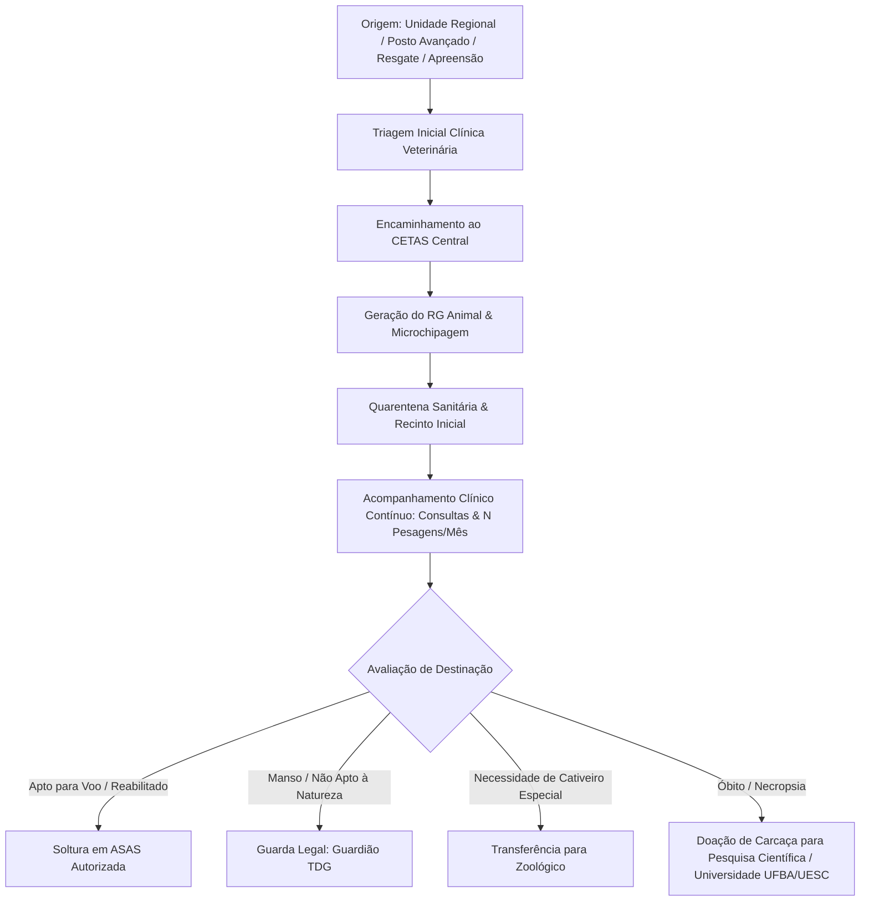

# Requisitos & Arquitetura: Módulo de Gestão de Fauna Silvestre

> **Sistema**: INEMA / SEIA (Bahia)  
> **Unidade Central**: CETAS (Centros de Triagem de Animais Silvestres)  
> **Data de Implementação**: 2026-09-09  
> **Status**: Implementado

---

## 1. Visão Geral do Módulo

O **Módulo de Gestão de Fauna Silvestre** do INEMA gerencia todo o ciclo de vida dos animais silvestres acolhidos, apreendidos ou resgatados no Estado da Bahia: **do Dia 1 (admissão) até a destinação final (soltura, guarda ou óbito com uso científico)**.

O sistema atua em estreita integração com as **Unidades Regionais do INEMA**, **Postos Avançados**, unidades do **CETAS**, **Áreas de Soltura de Animais Silvestres (ASAS)**, **Guardiões Autorizados (TDG)** e **Zoológicos/Criadouros**.

---

## 2. Identificação Única & "RG do Animal"

Todo animal possui uma identidade inequívoca gerada pelo sistema:
- **RG Animal**: Ex.: `FAUNA-BA-2026-00042` (Identificador permanente de rastreabilidade estadual).
- **Número CETAS**: Ex.: `CETAS-SSA-10492` (Controle do livro de entrada do Centro de Triagem).
- **Código de Marcação Física**:
  - **Microchip Eletrônico** (padrão ISO 11784/11785 de 15 dígitos);
  - **Anilha Aberta / Fechada** (padrão INEMA/CEMAVE);
  - **Brinco Auricular Numerado**;
  - **Tatuagem / Marcação Dérmica**;
  - **Identificação Natural / Fotoid**.

---

## 3. Fluxo do Ciclo de Vida do Animal

---

## 4. Cadastros Transversais & Módulos de Apoio

### 4.1. CETAS (Centro de Triagem de Animais Silvestres)
- Setor principal de cadastro, administração e reabilitação de fauna;
- Controle de capacidade máxima e ocupação em tempo real;
- Gestão de recintos: Quarentena, Ambulatório, UTI, Voadeiras de Treinamento de Voo, Maternidade Neonatal;
- Unidades ativas na Bahia: Salvador (Cabula), Porto Seguro e Vitória da Conquista.

### 4.2. ASAS / AASAS (Áreas de Soltura de Animais Silvestres)
- Cadastro de propriedades rurais públicas ou privadas homologadas pelo INEMA;
- Controle de CAR (Cadastro Ambiental Rural), bioma (Caatinga, Cerrado, Mata Atlântica), espécies autorizadas e área em hectares;
- Emissão de Termos de Soltura e monitoramento pós-soltura.

### 4.3. Guardião Responsável (Termo de Depósito e Guarda - TDG)
- Cadastro de Pessoas Físicas e Jurídicas detentoras da custódia legal provisória de animais silvestres não passíveis de soltura;
- Controle rigoroso de vistorias técnicas periódicas de bem-estar animal pelo corpo de fiscais e biólogos do INEMA.

### 4.4. Zoológicos & Mantenedouros (Cativeiro Permanente)
- Registro de animais mantidos em cativeiro contínuo (origem por doação, transferência de outro zoológico ou área pública com prévio cadastro no CETAS);
- Registro obrigatório de todas as ocorrências clínicas;
- Em caso de óbito, destinação regulamentada da carcaça com doação para pesquisa científica e coleções zoológicas universitárias (UFBA, UESC, UEFS).

---

## 5. Acompanhamento Clínico & Biometria Ponderal

- **Pesagens Frequentes**: Suporte ao registro de "N pesagens no mês" com cálculo automático de variação percentual ponderal e escore de condição corporal (1 a 5).
- **Prontuário Veterinário**: Registro de anamnese, diagnósticos presuntivos, prescrições de medicamentos (posologia e duração), exames laboratoriais/imagem e laudo conclusivo de aptidão para soltura.
- **Upload Documental**: Repositório integrado para fotos do animal no Dia 1, fotos da marcação/chip, termos de apreensão, GTAs (Guia de Transporte Animal) e atestados de óbito/necropsia.
- **Livro de Registro & Auditoria**: Rastreabilidade completa de todas as intervenções para fiscalização e auditoria ambiental.

---

## 6. Arquivos e Componentes Criados

| Arquivo | Descrição |
|---|---|
| [`src/types/fauna.ts`](file:///c:/Users/lguar/projetos/Inema/src/types/fauna.ts) | Tipagens TypeScript oficiais do modelo de dados da fauna |
| [`src/fauna.html`](file:///c:/Users/lguar/projetos/Inema/src/fauna.html) | Interface completa do módulo (Visão Geral, Prontuário, Admissão, Clínica, Cadastros Transversais, Documentos, Livro de Registro) |
| [`src/index.html`](file:///c:/Users/lguar/projetos/Inema/src/index.html) | Card no Acesso Rápido e item de menu no dashboard principal |
| [`src/fiscalizacao.html`](file:///c:/Users/lguar/projetos/Inema/src/fiscalizacao.html) | Link de navegação integrado na barra lateral |
| [`src/emergencia-quimica.html`](file:///c:/Users/lguar/projetos/Inema/src/emergencia-quimica.html) | Link de navegação integrado na barra lateral |
| [`src/relatorios.html`](file:///c:/Users/lguar/projetos/Inema/src/relatorios.html) | Link de navegação integrado na barra lateral |
| [`vercel.json`](file:///c:/Users/lguar/projetos/Inema/vercel.json) | Regras de rota limpa `/fauna` e `/gestao-fauna` |
